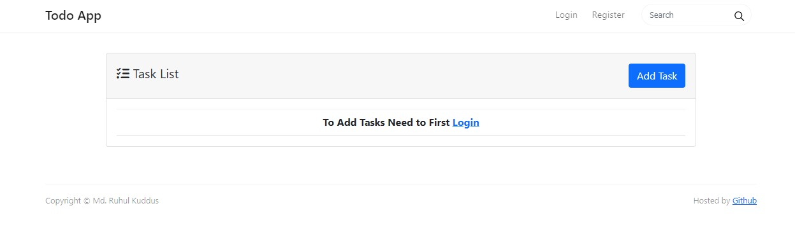
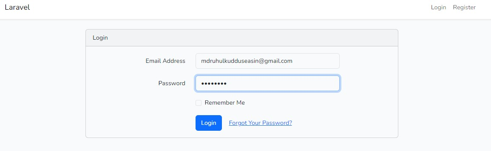
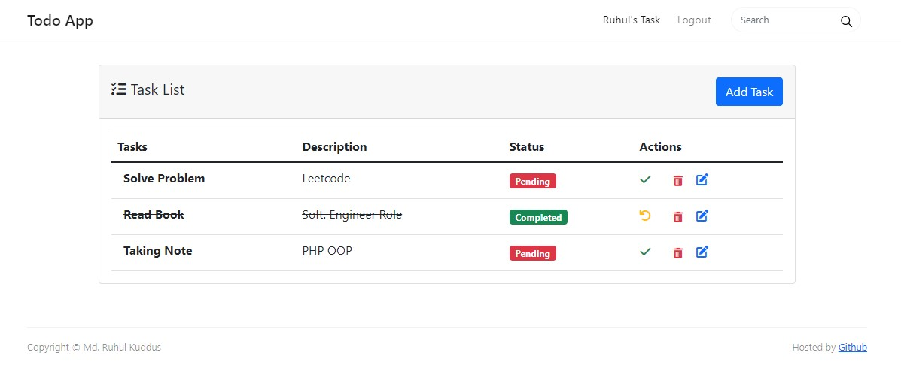
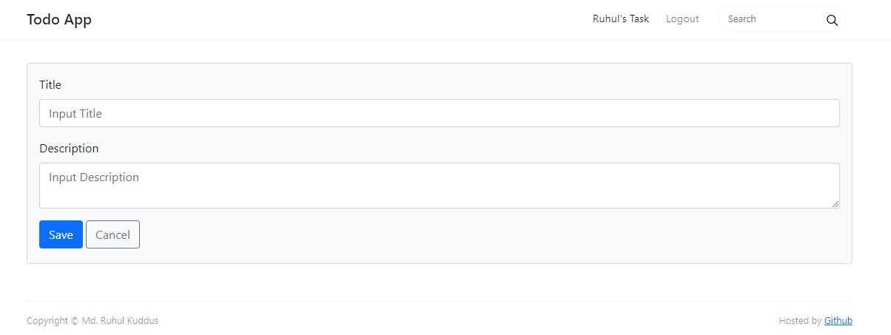
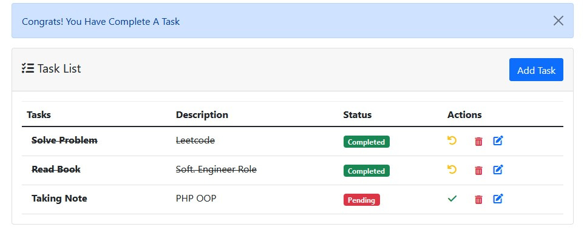
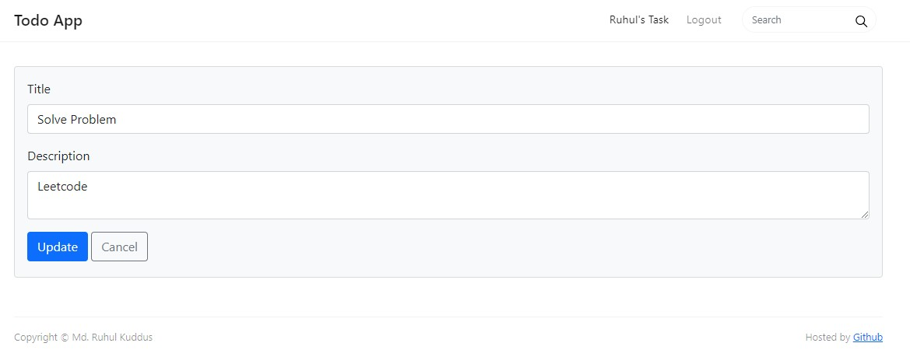
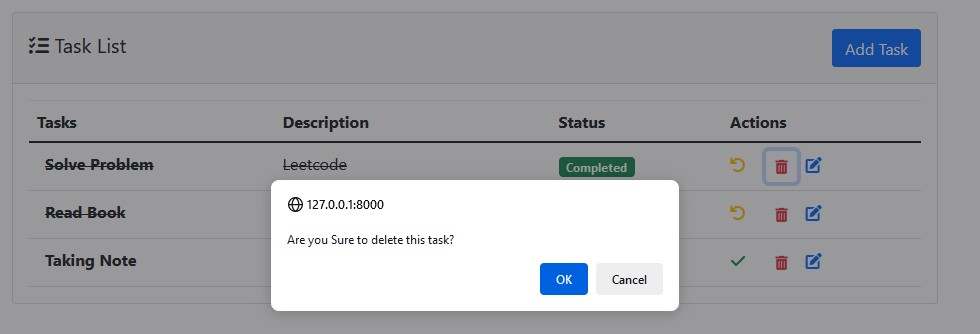

## Todo Application
<blockquote>
This is a simple web-based open-source Todo Application. where user can track on tasks
</blockquote>

## Features of Todo Application
<ul>
    <li>Login System</li>
    <li>Registration System</li>
    <li>Home Page</li>
    <li>Todo list</li>
</ul>

## Technology
<ul>
    <li>PHP</li>
    <li>Laravel</li>
    <li>MySQL</li>
    <li>JavaScript</li>
    <li>HTML</li>
    <li>CSS</li>
    <li>Bootstrap</li>
</ul>

## ScreenShot of this project

## To Add task Need to first Login
<table>
    <thead>
        <tr>
            <th>
                
            </th>
        </tr>
    </thead>
</table>

## Login Page
<table>
    <thead>
        <tr>
            <th>
                
            </th>
        </tr>
    </thead>
</table>

## Todo List or Home Page
<table>
    <thead>
        <tr>
            <th>
                
            </th>
        </tr>
    </thead>
</table>

## Add Task
<table>
    <thead>
        <tr>
            <th>
                
            </th>
        </tr>
    </thead>
</table>

## Complete Task & show alert badge
<table>
    <thead>
        <tr>
            <th>
                
            </th>
        </tr>
    </thead>
</table>

## Edit Task
<table>
    <thead>
        <tr>
            <th>
                
            </th>
        </tr>
    </thead>
</table>

## Delete Task Popup
<table>
    <thead>
        <tr>
            <th>
                
            </th>
        </tr>
    </thead>
</table>
